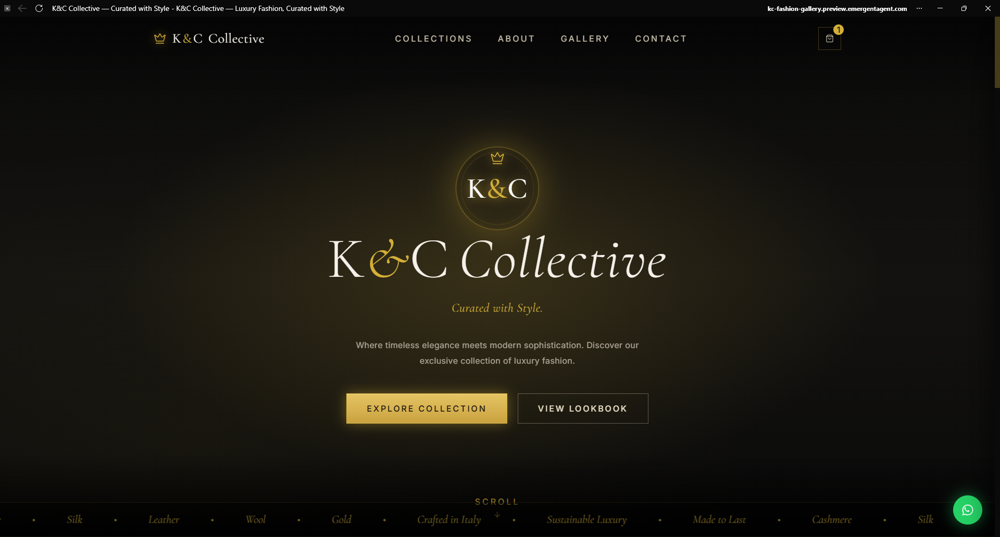
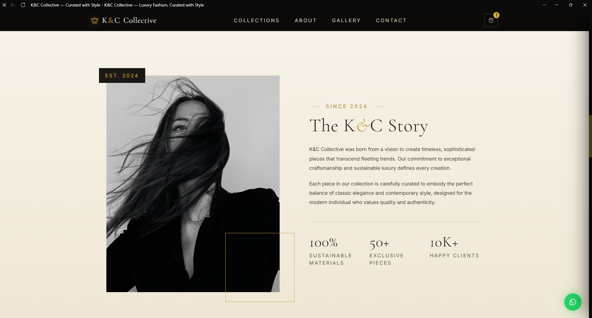

# Hi there, I'm syntaxstylecorporation-tech 👋

## Welcome to my GitHub profile!

I'm a **Software Developer | Bot Developer | API Integration Specialist** passionate about building automation systems, payment integrations, and scalable web applications.

---

## 🛠️ Tech Stack & Expertise

---

## 🚀 About Me

- 💻 **Self-taught Software Developer** with hands-on experience in bot and web development
- 🤖 Specialized in **WhatsApp automation bots** and **API integrations**
- 🌐 Built and deployed my own e-commerce website with custom domain management
- 🔗 Experienced in integrating **payment gateways, banking APIs, and e-wallet systems**
- 💳 Experienced integrating **payment gateways** (PayPal, banking APIs, e-wallets)
- 🌱 Continuously learning **Full-Stack Web Development** and modern technologies
- 🤝 Open to collaborations on Web Development, Bot Development, API Integrations, and Automation Projects
- 🎯 Passionate about learning by building real-world projects

---

## 💼 Technical Skills & Expertise

### Core Competencies
- **Software Development** – Building scalable applications and solutions
- **API Integration** – PayPal, banking services, e-wallet systems
- **Bot Development** – WhatsApp automation and community management
- **Web Development** – Full-stack development, custom domains, deployment
- **Automation** – Workflow solutions, task automation, intelligent systems

### Technical Stack
- **Languages:** JavaScript, Python
- **Platforms:** WhatsApp Business API, Node.js
- **Payment Systems:** PayPal API, Banking APIs, E-wallet integrations
- **Web Technologies:** HTML, CSS, JavaScript, Web frameworks
- **DevOps & Deployment:** Custom domain setup, website deployment, hosting management
- **Tools & Platforms:** Git, GitHub, API development tools

---

## 🌟 Featured Projects

### 🌐 KC Collective Shop

Designed, developed, and deployed a luxury fashion e-commerce platform using a custom domain. The project demonstrates front-end design, product presentation, branding, deployment, and customer engagement features.

#### Highlights
- Custom domain configuration
- Responsive luxury-themed UI/UX
- Product collections and gallery system
- Contact and customer engagement features
- Website deployment and maintenance

#### Screenshots

| Homepage | Collection |
|----------|------------|
|  |  |

| About Section | Gallery |
|---------------|---------|
|  |  |

🔗 **Live Website:** [https://shop.kccollective.vip](https://shop.kccollective.vip)

---

### 🤖 WhatsApp Community Management Bot
A sophisticated WhatsApp automation bot built from scratch for community moderation.
- **Key features:**
  - Automatic spam detection and removal
  - Intelligent link filtering and moderation
  - Welcome and goodbye message automation
  - Automated chat responses and engagement
  - Advanced group management features
  - Real-time event handling and processing
- **Tech Stack:** Node.js, WhatsApp Business API, JavaScript
- **Impact:** Streamlined community management and reduced manual moderation effort

### 💳 Payment & Financial API Integrations
Multi-platform payment processing solutions for online systems.
- **Integrated services:**
  - PayPal payment integration
  - Bank API integrations
  - E-wallet service integrations
  - Payment processing automation
  - Transaction workflow development
- **Tech Stack:** JavaScript, REST APIs, Payment gateways
- **Impact:** Enabled secure, seamless payment processing for digital products

---

## 🌱 Current Focus

- 🌐 **Expanding Full-Stack Web Development skills** – Building modern, scalable web applications
- 🤖 **Developing and improving WhatsApp automation bots** – Enhanced features and reliability
- 🔗 **Integrating advanced APIs** – Payment gateways, banking, and e-wallet services
- ⚙️ **Building automation tools** – Creating workflow solutions and intelligent systems
- 🚀 **Creating scalable applications** – Real-world digital products with performance in mind
- 📚 **Continuous learning** – Staying updated with new technologies, APIs, and best practices

---

## 🚧 Currently Building

- Advanced WhatsApp Automation Systems
- Payment Integration Solutions
- Scalable Web Applications
- API-driven Digital Products

---

## 📊 GitHub Activity

---

## 📞 Connect With Me

I'm always interested in discussing technology, collaborating on projects, and exploring new opportunities!

- 🌐 **Website:** [shop.kccollective.vip](https://shop.kccollective.vip)
- 💻 **GitHub:** [github.com/syntaxstylecorporation-tech](https://github.com/syntaxstylecorporation-tech)
- 📧 **Email:** [syntaxstylecorporation@gmail.com](mailto:syntaxstylecorporation@gmail.com)

### 🤝 Open to Collaborations

I'm actively seeking partnerships on:
- 🌐 Web Development projects
- 🤖 Bot Development initiatives
- 🔗 API Integration solutions
- ⚙️ Automation Projects

---

## 💡 My Philosophy

> **Learn by Building** – I believe the best way to master software development is to build real-world projects, solve actual problems, and iterate based on feedback. Every project is an opportunity to level up!

---

## 🎯 Quick Facts

- 📈 **Self-taught journey:** From zero to building production applications
- 🚀 **First achievement:** Deployed personal e-commerce website with custom domain
- 💪 **Strength:** Converting ideas into working automation solutions quickly
- 🔄 **Approach:** Hands-on learning through practical projects
- 🌍 **Vision:** Build scalable, impactful digital solutions that solve real problems

---

## ⭐ Support My Work

If you find my repositories, projects, or contributions helpful, consider giving them a star! Your support motivates me to keep building amazing things and sharing knowledge with the community.

---

*"Code is poetry. Automation is freedom."* 🚀
